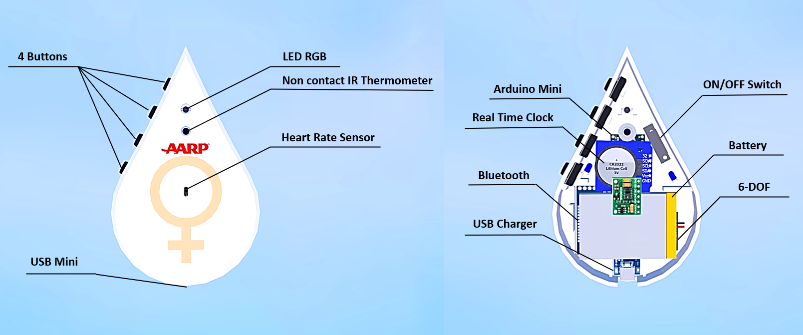
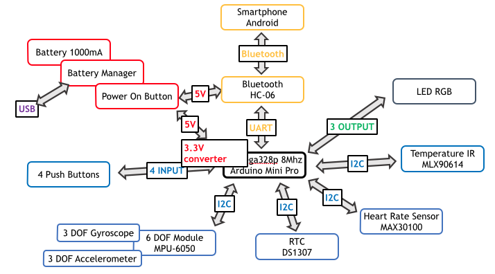

# Hygie
A device to better follow your body's reactions. Hygie helps you to understand the evolution of symptoms that can affect you on daily basis

Created by Jean Perardel

Full Tutoriel on [Hackster](https://www.hackster.io/jeanperardel/hygie-better-follow-and-understand-your-menopause-fa8663)

Presentation Video on [Lab_1314](https://www.youtube.com/watch?v=uz1osdS2IEg)

## Storie

The Hygie project has been designed to help women listen to and follow their bodies during this complicated period. To do this, it offers a simple and evolving interface that allows the different symptoms to be traced over time. The small device can easily fit into a coat pocket or handbag to accompany you discreetly everywhere.

Hygieia (Hygie in French) was one of the daughters of the God of medecine Asclepius in the Greek mythology. she was the goddess/personification of health.

The 4 buttons on the top allow you to trace the symptoms over time. Each of them must be associated with one (single click) or two (double click) symptoms according to the need and therefore recurrence for its user.

Here is a configuration example :

Button 1 (single click) : Hot Flashes

Button 1 (double click) : Fatigue

Button 2 (single click) : Hair Loss

Button 2 (double click) : Incontinence

Button 3 (single click) : Change in odor

Button 4 (single click) : Mood Swings

Pressing these buttons at the onset of symptoms will allow you to trace the event over time and better understand their recurrence. Using Hygie for a period of time will thus generate graphs on the mobile application.

These data are also associated in tabular form with simple interpretations such as "The phenomenon of fatigue is particularly present after a meal" or "Gum problems" are often associated with "Breast Soreness".

## Build the device

## Hardware

The most important thing to remember here is that almost whole the system works in 3.3V. This forced me to carefully select the components (at first I wanted to use WS2812 RGB LEDs, but they are rather unstable in 3.3V so I had to remove them... too bad for the color rendering!).

At first, I thought the 3.6V Bluetooth would work on the 3.7V battery, but it seemed unstable... So I had to add a BOOST at the end to power only this part with 5V and step down everything else with the embedded regulator on the Arduino Pro Mini. I will probably change the Bluetooth board on the next version to remove the BOOST and have the all system working at 3.3V. This will also be a good occasion to move to BLE.

Another interesting part will be to develop small boards with MOSFETs to cut the power supply of unused modules. Indeed, this system uses some functionality only very occasionally. It is therefore a pity that a module like the MPU6050 consumes power all the time.

## Software

Arduino development on a Atmega328p target running at 8Mhz (FIO mode) 

## 3D design

## Phone Graph (MIT App Inventor)

